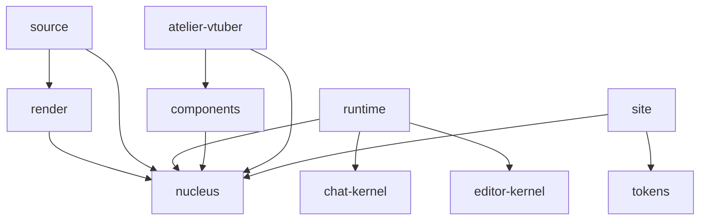

# ARCHITECTURE — how shrubbery fits together

The one-paragraph model, then the maps. shrubbery is a **pure RDF → UI
interpreter** plus a component library. There is no framework, no page router in
the library, no backend in the library. A site is *a graph + an interpreter + a
component library*. This document is the "how it fits together" map: the
pipeline, the one backend seam and why it exists, the package graph, the shells,
and where the tests live. For the *what* (package/app inventory, one line each)
see [`README.md`](README.md); for dated construction logs see
[`docs/history/`](docs/history/README.md).

## The pipeline

> **Emporium mints the triples → a cell stores them → the interpreter consumes
> them → the renderers project them to a target.**

Read left to right; every stage is a real, testable function over data.

| Stage | What happens | Where it lives |
|---|---|---|
| **mint** | A vocabulary/workspace is emitted as RDF triples (N-Triples / the `sux:` frontend ontology). The Emporium is the canonical minter; any producer of `sux:` triples works. | upstream (garden/emporium tooling) + `apps/emporium` |
| **store** | Triples land in a *cell* (a gardend graph, a hosted gateway, a static `.nt` fossil, or any SPARQL endpoint). The library never talks to a cell directly — it goes through a `TripleSource`. | `packages/source` (`TripleSource` adapters), seam in `packages/nucleus/src/triple-source.ts` |
| **parse** | N-Triples → `WorkspaceConfig`. `parseNT` → `parseTriplesToConfig`. The RDF ↔ config codec is symmetric (`serializeConfigToTriples` round-trips). | `packages/nucleus/src/workspace/` (`rdf-model.ts`, `ux-rdf.ts`) |
| **interpret** | `planFor(config, app?) → LayoutPlan` — the target-agnostic layout tree (regions → panels → leaves; grid/collection nodes; a persistence taxonomy). This is the engine. | `packages/nucleus/src/workspace/interpreter.ts`, `packages/nucleus/src/layout/solver.ts` |
| **render** | The `LayoutPlan`/resource is projected to **one of four faces of the same resource** (the render target is a *parameter*). | `packages/runtime` (dom) + `packages/render` (hypertext/turtle/json) |

### The render target is a parameter

The same plan renders to four faces. `render/src/target.ts` is the heart of it:
`renderResource(resource, target, ctx)` dispatches on `RenderTarget`.

| Target | Face | Renderer |
|---|---|---|
| `dom` | Live Lit DOM (custom elements, the interactive app) | `packages/runtime` — `renderWorkspace(config)` (the Lit face is the runtime's, not the pure render package's) |
| `hypertext` | Beautiful curl-able markdown + a "Navigate" block + HATEOAS `AltLinks` (FAIR Signposting / RFC 8288) | `packages/render/src/render-hypertext.ts` |
| `turtle` | RDF/Turtle (reuses `serializeConfigToTriples`) | `packages/render/src/render-turtle.ts` |
| `json` | Compacted JSON-LD (`jsonld.fromRDF` → compact with the shared `@context`) | `packages/render/src/render-json.ts` |

**Content negotiation is an app concern, not a library one.** `negotiate()`
(`packages/render/src/negotiate.ts`) is the ONE pure decision rule — explicit
`.ext` always wins, else `Accept` → target — but *serving* it (the CloudFront
`Accept`→ext rewrite, the local `conneg/` dev server) lives in the shells. One
URL grammar, four faces; agents browse by following the `Navigate` links, which
is why the hypertext face is first-class rather than a debug view.

## The one backend seam, and why the library is backend-free

The single most load-bearing design fact. **`packages/nucleus/src/contract.ts`
is the ONE backend surface the library may touch, and it is interface-only —
shrubbery ships no concrete for any of it.** Quoting the contract's own header:

> INTERFACE-ONLY. `shrubbery` ships NO concrete for any of these. Each of the
> three deployment shapes — garden desktop, cloud-2 cell SPA, choreograph Studio
> — is a thin app-shell that builds a `ShrubberyContract` and injects it at boot.
> The library reads backend state through these seams and never reaches for a
> socket, a token, a Tauri global, or `window.*` directly.

The contract formalizes the four hard couplings a frontend audit named, plus
REST and UI:

| Seam | Interface | Replaces the raw coupling |
|---|---|---|
| Auth-token supply | `AuthProvider` | direct Cognito/token reads; `whenReady()` kills the "WS 401 before token" race |
| CRDT transport | `CrdtBackend` / `CrdtRoom` / `ProviderHandle` | a hard `yjs` dependency — handles are *opaque*, a shell binds them to `Y.Doc`/`Awareness` |
| Runtime mode | `RuntimeModeProvider` | the `__MN_RUNTIME_MODE__` global |
| Native bridge | UI services (dialogs / icons / presence) | Tauri globals / `window.*` |
| Read | `TripleSource` (`triple-source.ts`) | a bespoke cell client — the store seam of the pipeline above |

**Why backend-free:** it makes the library a pure function of its inputs, so
*every* stage above is testable against real data with no server, and so the
same library drives multiple radically different shells (a Tauri desktop, a
cloud SPA, a curl server) that share nothing but the contract. Auth / CRDT /
HTTP / Tauri all live *shell-side*, behind the seam.

## Package dependency sketch

Ten packages under `packages/`. Arrows point at what a package depends on
(workspace deps only, per each `package.json`); `nucleus`, `tokens`,
`chat-kernel`, and `editor-kernel` are leaves.

| Package | npm name | Role |
|---|---|---|
| `nucleus` | `@shrubbery/nucleus` | the engine: `planFor → LayoutPlan`, RDF↔config codec, the `ShrubberyContract` + `TripleSource` seams |
| `render` | `@shrubbery/render` | Lit-free render-target core: turtle / JSON-LD / hypertext faces + `negotiate` |
| `runtime` | `@shrubbery/runtime` | the render host: `planFor → LayoutPlan → Lit DOM` (the `dom` face) |
| `components` | `@shrubbery/components` | backend-free skin-aware Lit components (chrome + primitives) |
| `atelier-vtuber` | `@shrubbery/atelier-vtuber` | `<mn-vtuber>` — the heavier three/VRM avatar, split out of components |
| `tokens` | `@shrubbery/tokens` | the layered design-token CSS + `{skin,theme}` applier; leaf |
| `source` | `@shrubbery/source` | `TripleSource` adapter factories (static-nt / gardend-local / hosted-gateway / sparql) |
| `site` | `@shrubbery/site` | declarative product bundles (routes/faces/appearance) over a canonical layout |
| `chat-kernel` | `@shrubbery/chat-kernel` | pure chat render kernel; couplings severed; leaf |
| `editor-kernel` | `@shrubbery/editor-kernel` | pure TipTap/ProseMirror editor kernel; couplings severed; leaf |

## The shells — and which is authoritative

Eight apps under `apps/`; the *backend lives here*, behind the contract. They
are not equal in status.

| Shell | Role | Authority |
|---|---|---|
| `apps/organism` | the live RDF→UI playground; boots the real render host against real RDF + the shell-side `gardend` read client | **AUTHORITATIVE — the CI-gated shell.** `.github/workflows/ci.yml` typechecks, builds, and runs the real-Chromium `test:browser` suite against `@shrubbery/organism` only. |
| `apps/emporium` | dedicated product shell for the live vocab-pack catalogue (emporium skin) | product |
| `apps/planter` | generic curl-able + browsable host over *any* `TripleSource` (four conneg faces + SPA) | product; see `docs/planter/` |
| `apps/rhizome` | read-only memory observatory — renders a cell's `:projection:memory` graph as curl-able resources | product |
| `apps/greenhouse` | **Greenhouse v1** — live-only scientist's workbench for Choreograph agents (greenhouse skin). *Current* of the two Greenhouses. | product |
| `apps/vehicle` | the earlier "Greenhouse app" / AgentWorld cockpit for the SRS/Vehicle line (greenhouse skin) | superseded by `apps/greenhouse` |
| `apps/atelier` | the minimal "plain text" Sophia — one text region, no chrome, booted live from a real gardend `:ux:config` | demo/probe |
| `apps/storybook` | the component catalogue (chrome under real tokens) + the `conneg/` server that serves the curl faces | tooling |

Only `organism` gates CI. Treat any behavioral claim as proven when the
organism proves it in real Chromium; the other shells are products and probes
that reuse the same library.

## Where the tests live — three lanes

"No mocks" is enforced structurally: a stubbed contract is a mock, a real
browser is not. Tests run in three lanes, split by cost/infra.

| Lane | Command | What it exercises | Infra |
|---|---|---|---|
| **source** | `pnpm test:source` | every package's unit/pure suites — real functions over real inputs, real DOM via happy-dom. Excludes `*.browser.test.ts` (generically discovered by `test:browser-suites`), `*.integration.test.ts`, and `*.probe.test.ts`. This is the CI `test` job. | none (no ambient binary) |
| **integration** | `GARDEN_BIN=… pnpm test:run` (also `*.probe.test.ts`, e.g. the planter FID-004 live-read gate) | the library against a *real* `gardend` cell / a real `TripleSource` | a real `gardend` binary |
| **browser** | `pnpm --filter @shrubbery/organism test:browser` and workspace-wide `pnpm test:browser-suites` | the production organism shell plus every `*.browser.test.ts` suite in real Chromium | Playwright Chromium; the CI `browser` job |

The `no-mocks` invariant is ratcheted by
[`scripts/validate-no-mocks.mjs`](scripts/validate-no-mocks.mjs): the pure core
holds it strictly, the app layer carries a small *frozen* set of stubs, and the
ratchet lets that set only shrink. See the README's Principles section.

## Reading order for a new engineer

1. `packages/nucleus/src/contract.ts` — the seam, and its header (the *why*).
2. `packages/nucleus/src/workspace/interpreter.ts` — `planFor`, the engine.
3. `packages/render/src/target.ts` — the four faces of one resource.
4. `apps/organism/src/main.ts` — a real shell wiring all of it, with no mock.
5. `docs/planter/README.md` — a worked slice (the `TripleSource` seam end to end).
